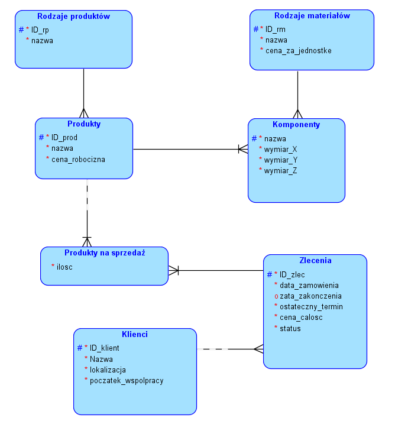

# Stolarnia_uWuja
## Opis

Program ma na celu pomoc w zarządzaniu stolarnią. Jednakże będzie to miejsce w którym nie produkuje się mebli, a opakowania potrzebne później do transportu towarów (np. palety 120x80, skrzynki z płyty OSB). 

Każdy produkt (np. skrzynka) składa się z (najczęściej) z kilku komponentów (gwoździe, deski, klocki, itp) oraz należy do pewnej kategorii produktów (paleta, skrzynka, stabilizator, itp). 

Każdy komponent jest z pewnego rodzaju materiału (deska 19mm, płyta OSB, itp). W naszej rzeczywistości istnieć będą również klienci. 

Główną funkcjonalnością (oprócz dodawania nowych produktów i klientów do bazy) będzie dodawanie zamówień do listy już obecnych. Zamówienie zawiera w sobie niezbędne dane klienta, oraz ilość konkretnych produktów które ma wykonać do określonej daty. 

Administrator systemu (czyt. kierownik zakładu) będzie jedyną osobą wymaganą do działania systemu (zakładamy że stolarnia jest niewielka, więc takie rozwiązanie w zupełności wystarczy). Oprócz tego będzie można wyświetlać dane produktów.

___

## Diagram UML

  

___
